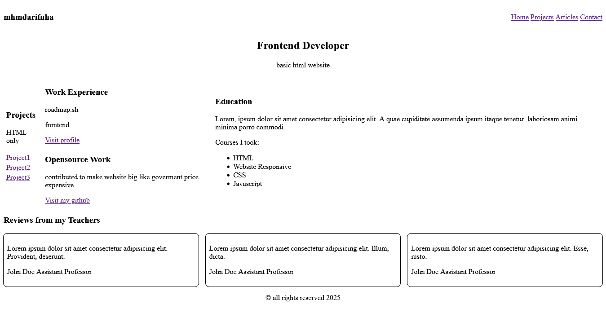

## Challenge 2 basic HTML website

[Project-basic-html-website](https://roadmap.sh/projects/basic-html-website)

## Description

This project is challenge from roadmap.sh for train my skill create website

## How to start

1. Clone this repository.
2. Open file `index.html` on your browser.

## Screenshot

## Note

- I still learn about SEO website
