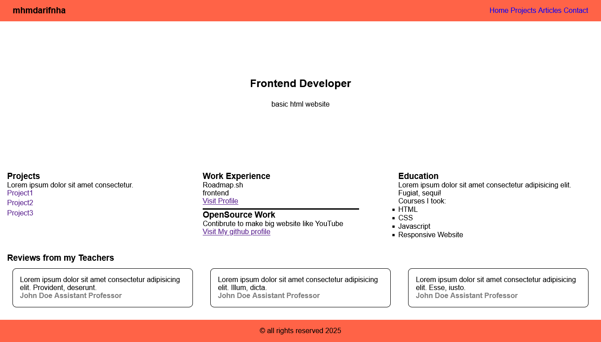

## Challenge 3 portfolio website

[portfolio-html](https://roadmap.sh/projects/portfolio-website)

## Description

This project is challenge from roadmap.sh for train my skill create website using HTML and styling use CSS

## How to start

1. Clone this repository.
2. Open file `index.html` on your browser.

## Screenshot

## Note

- I still learn about SEO website
